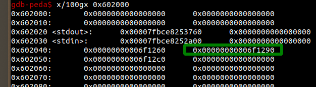
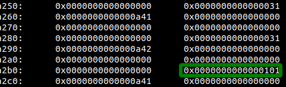
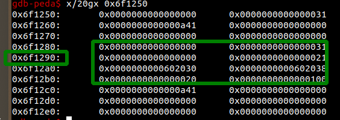
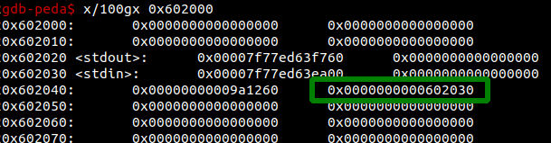

# iz heap lv2
違う人が解いた。unsafe unlink わからんかったので書く。

## バイナリ概要
add, edit, delete, showが使えるメモ帳的なもの。アドレスと、サイズが保存される。削除も適切。   
addおよびeditのデータ入力に利用される関数にoff by oneがある。

## 方針検討
heapのoff by oneは、次のチャンクサイズが0x100以上であれば、prev inuseビットをクリアすることができる。  
heapのfdを触れないのでdupは作れない。chunkの中には特に有用な情報もない。  
大きくfreeするとarenaアドレスは出るが、削除が適切なためアドレスが残らず、参照できない。  
この場合に有用なのがunsafe unlink   
heapの管理部が0x602040から続いているので、この辺りを狙って書き換えればよい。   
gotは書けないので、gotからのleakが終わったら、heapのhookを書き換える。    
libc-2.27なので、前処理としてtcacheを使い切る必要がある（7個確保してfree）   
したがって方針は以下の通り。    
1. 最初に２つ小さめのchunkを用意
2. tcacheを使い切る
3. ２つめのchunkを削除
4. unlink用のペイロード（後述）で２つめのchunkを確保し直す
5. ３つめのchunkを削除して、unlink発動。（ここで２つめのchunkのアドレスが0x602030になる。）
6. ２つめのchunkを編集して、１つめのアドレスをgotに書き換え、リーク
7. 再び２つめのchunkを編集して、１つめのアドレスを今度はfree_hookへ
8. １つめのchunkを編集して、systemのアドレスを入力
9. 新しく内容が"/bin/sh"のchunkを追加し、削除すればシェルが立ち上がる

## unlink attack

動作を順に書いていきます。  

  
↑tcache使い切った直後。緑の四角が今回の主役。２つめのチャンク。

このケースでは0x6f1000からheap領域が確保されていて、
- １つめ/0x6f1260：サイズ0x30、リークと編集に利用。
- ２つめ/0x6f1290：サイズ0x30、偽のfreeチャンクを持つ。また、このアドレスが記載されている0x602048がunlinkの今回のターゲットとなる。
- ３つめ/0x6f12c0：サイズ0x100、unlinkのトリガーになる。 

  
↑緑の四角が３つめのチャンクのサイズの部分。0x101となっていて、prev inuseビットが立ってる。
ここから２つめのチャンクをfreeして、同様のサイズで取り直す。

   
↑２つめのチャンクを取り直した直後。
prev inuseはクリアされている。  
あとは２つめを指すポインタ、0x6f1290から見たチャンクがfreeされているように見えるように偽チャンクを内包している。  
構成は以下の通り。  
- 0x6f1290:p64(0) + p64(0x21) チャンクサイズ見せるだけ。0でもいい。その他の値はだめっぽい
- 0x6f12a0:p64(target-0x18) + p64(target - 0x10) unlinkの条件P->fd->bk = P->bk->fdを満たすため、結局targetがこのチャンクを指しているなら、-0x18, -0x10のオフセットを入れれば良い。考える場合は紙でやると良い。１個ずつ書けば分かった。 
- 0x6f12b0:p64(0x20) prev sizeを書く。偽チャンクのサイズが書ければい。今回は0x20。またこの書き込みによって、次のチャンクのサイズの部分をnullで潰せるので、0x101のところが0x100になる。

   
↑そして、３つめのチャンクを消した直後。２つめのチャンクが0x602030を指すようになる。この状態で２つめのチャンクを編集しようとすると、0x602030からデータが格納されるので、例えば0x602040を上書きできる。  
あとは２つめのチャンクのアドレスを壊さないように、１つめのチャンクを編集すれば良い。  
１つめのチャンクにgotアドレスを書いてリークできるし、hookアドレスを書いて編集すればhookに書き込める。これが、最初に２つチャンクを用意した理由。  
スクリプトはそのままでは改行が入って壊れるが、修正が面倒だったのでちょっとサボって実装している。

### 成立条件
- 0x100のサイズを超えるチャンクを確保し、freeできる
- 直前のチャンクにoff by oneがある
- targetとなるアドレスが偽のfreeチャンクを指している。
