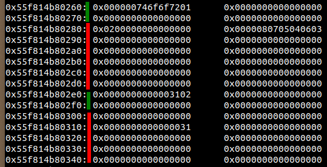
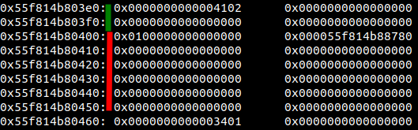
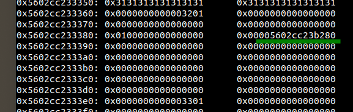
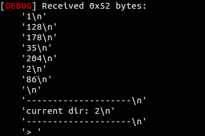
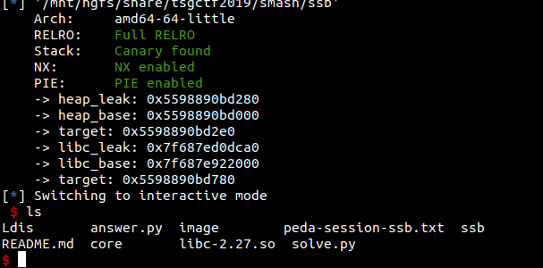

# Super Smash Bros
アドレス入力方法がユニークでおもしろい。
## バイナリ概要
ファイルシステムを模したもの。ファイルとディレクトリを追加、削除ができる。ファイルは中身が見られる。ディレクトリを変更する機能がある。ディレクトリの一覧も見られる。  
ファイルはある程度サイズが大きくなると、記憶領域を別のheapで確保するようになる。  
別のheapに取らない最大サイズ0x50でファイルを取るときに、隣接するファイルのヘッダとファイル名あたりを上書きできる。   

ファイルの構造は以下の通り。  
```
char type;
char name[0x26];
char flag;
int *pointer;
char data[0x50];
``` 
構造体のサイズは0x80  
typeにはディレクトリ：1、ファイル：2が入る。  
flagは、データを持つときに別途heapポインタを持っているかどうかが入る(１：ポインタあり)

  
↑こんな感じ。最初の緑線の部分の0x746f6f7201が、'root'と01なのでディレクトリを示す。ちなみにこれはバイナリ起動時に作成される。  
次の赤線の部分が格納場所を1byteずつで表している。

その下の緑が次の構造体が格納されている。0x3102なので名前が'1'、02なのでファイルを示している。データはこのとき直接格納していて、flagは0になっている。データ内容は'1'

   
↑こっちが0x50以上で格納したとき。flagが1になっていること、ポインタが格納されていることがわかる。

ファイルの追加のとき、サイズが0x50以下であればdataが使われる。0x50より大きい場合はflagが1になり、ポインタ先に確保される。  
サイズを小さく指定しながら少し大きく書き込める。  
ディレクトリだと、pointer以下の部分にファイルの格納場所が1byteずつ格納される。

## 方針検討
隣接するチャンクのtypeを書き換えることで、ディレクトリとファイルが変えられる。ファイルとして作成したチャンク
をディレクトリに変えると、pointerの部分を格納場所と捉えてアクセスする。  
同様に、ディレクトリにしたところをファイルにすると、flag=1の条件があれば、格納場所の記録列をポインタと捉えてアクセスするようになる。ここの書き換えがトリッキーだが軸となる方針は極めてシンプル。 
1. heapアドレスを特定
2. libcアドレスを特定
3. hookの書き換え

gotの場所がわからんため、libcはfreeから出す方で。
### heapアドレス
0x50より大きなサイズでファイル作成し、typeの部分を書き換えてディレクトリにすることで、ポインタ部分のを格納場所と解釈して表示するため、これを利用する。
**すべてのファイルの格納場所と、ファイル名を一致させて作成する。（n番目のファイル名は'n'になるように。）** 

   
↑typeの部分をディレクトリにしてやれば、ポインタ部分をディレクトリ格納場所と解釈して、ファイル一覧コマンドを呼ぶと、
  
↑該当箇所にあるファイル名が表示される。やってると気づくが、アドレスにnullが含まれると消えるので、失敗する可能性がある。

### libcアドレス
取り急ぎtcacheを使い切って大きなサイズをfreeしておく。最初で0x90を8つ確保してfreeしておいた。  
またarenaアドレスの、heapのベースアドレスからのオフセットを事前に把握しておく。  
次にそこを指せるようにディレクトリにファイルを格納していく。これがこの問題の一番おもしろいところ。n番目に格納すると、格納場所がnになることを利用する。  
まず、最後にリーク用のファイルに変えるためのディレクトリを作っておいて、他のディレクトリでn-1番目までファイルを作成していって、先のリーク用ディレクトリに変えて、n番目のファイルを格納。n番目のファイル以外のファイルをすべて削除して次の値を入れるという操作を6回繰り返す。  
これの実装に3平日使った。1ディレクトリが90個くらいしか入らないので、root以外に２つディレクトリを作る必要があった。
出来上がったらファイルに変えて、中身にアクセスするときれいに表示される。

### hookの書き換え
上の方法で2重にチャンクを指せる状態にすれば良い。```free("/bin/sh")```ができるので、hookはsystemに書き換えた。
